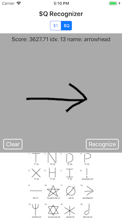

# Dollar Recognizers 

[](https://travis-ci.org/DanielCardonaRojas/DollarGestureRecognizer) 


Implements the family of popular dollar recognizers in swift and expose them as a set of custom UIGestureRecognizer
subclasses.

For a detailed discription on how all this works refer to the [papers](http://depts.washington.edu/madlab/proj/dollar/ndollar.html)


## Features

- Load templates from bezier paths.
- UIGestureRecognizer implementations for each recognizer in the dollar recognizer algorith family.

## Installation

**Cocoa pods**
```sh
# Add this to your Podfile
pod 'DollarGestureRecognizer', :git => 'https://github.com/DanielCardonaRojas/DollarGestureRecognizer', :branch => 'develop',  :tag => 'v1.0.0'
```

## Dollar family algorithms

- [x] Implement the protractor optimization for the $1 recognizer.
- [x] Implement the $Q recognizer

## Screenshots


